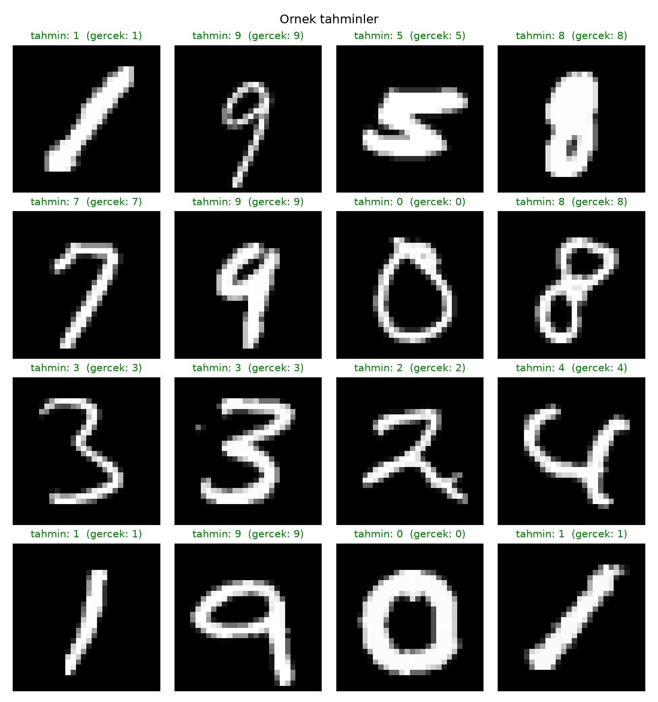
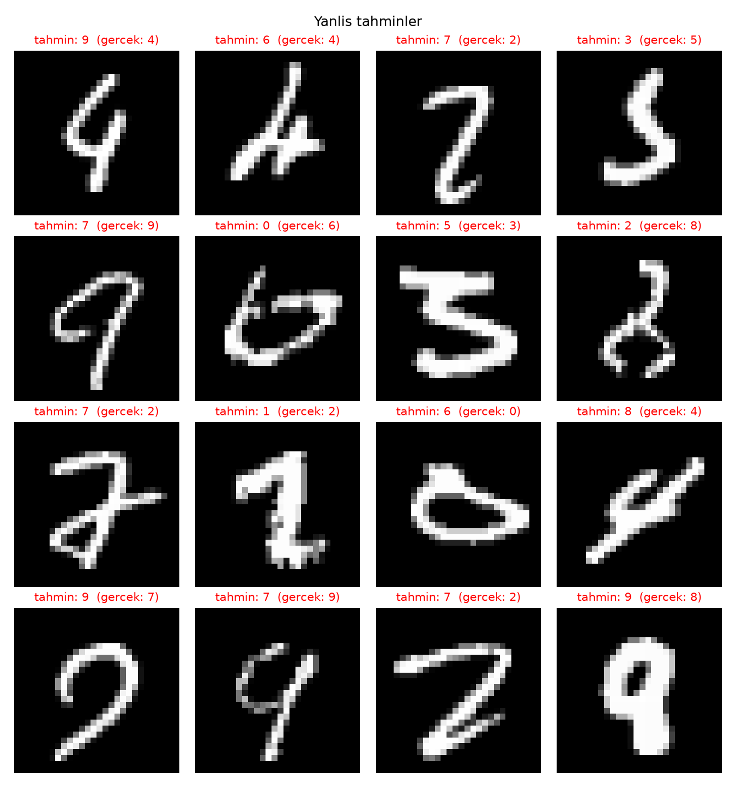

# TinyTorch from Scratch

A deep learning framework built from scratch in pure NumPy, used to train a CNN on MNIST to **98.70% test accuracy**.

The core library follows Harvard's [TinyTorch](https://mlsysbook.ai/tinytorch) curriculum (MLSysBook). I implemented the modules myself, then went beyond the course material: I vectorized the convolution layer, trained a CNN end-to-end, and ran a hyperparameter study.

## What's implemented

| Module | Contents |
|---|---|
| Tensor | Arithmetic, broadcasting, matmul, reshape/transpose, reductions |
| Autograd | Reverse-mode automatic differentiation with 15+ backward functions and broadcast-aware gradients |
| Layers | Linear, Dropout, Sequential, Conv2d, MaxPool2d |
| Activations | ReLU, Sigmoid, Tanh, GELU, Softmax |
| Losses | MSE, Cross-Entropy (numerically stable log-softmax), Binary Cross-Entropy |
| Optimizers | SGD, Adam, AdamW |
| Data | Dataset, DataLoader, augmentation (random crop, horizontal flip) |
| Training | Trainer loop, cosine LR schedule, gradient clipping, checkpointing |

## My additions (`examples/mnist/`)

### 1. Vectorized convolution (im2col)
The course version of `Conv2d` used nested Python loops, which made training on the full MNIST set impractically slow. I rewrote the **forward and backward passes** using im2col and a single matrix multiplication:

- `patch_convolution.py`: adds `_im2col` and `_convolve_im2col` to the forward pass
- `patch_backward.py`: vectorized backward (`dW = g @ colsᵀ`, `dX = col2im(Wᵀ @ g)`); the original is kept as `apply_slow`
- `test_convolution.py`, `test_backward.py`: check that the vectorized outputs and gradients match the loop-based reference across kernel sizes, stride and padding settings

### 2. CNN on MNIST
`train.py` trains the following architecture with Adam (lr = 0.001, batch size 64) on all 60k training images:

```
Conv(1→8, 3x3) → ReLU → MaxPool → Conv(8→16, 3x3) → ReLU → MaxPool → Linear(784→128) → ReLU → Linear(128→10)
```

| Epoch | Loss | Test accuracy |
|---|---|---|
| 1 | 0.2019 | 97.91% |
| 2 | 0.0633 | 98.38% |
| 3 | 0.0450 | 98.40% |
| 4 | 0.0358 | 98.68% |
| 5 | 0.0283 | **98.70%** |

### 3. Hyperparameter sweep
`sweep.py` changes one factor at a time from the baseline (10k training samples, 2 epochs):

| Experiment | Test accuracy | Time (s) |
|---|---|---|
| Baseline (lr 0.001, batch 64, 8/16 ch, hidden 128) | 95.40% | 234 |
| lr = 0.01 | 96.21% (+0.81%) | 232 |
| lr = 0.0001 | 88.15% (−7.25%) | 230 |
| batch = 16 | **97.18% (+1.78%)** | 215 |
| batch = 256 | 92.20% (−3.20%) | 206 |
| channels 4/8 | 95.52% (+0.12%) | 134 |
| channels 16/32 | 95.53% (+0.13%) | 447 |
| hidden = 32 | 93.56% (−1.84%) | 212 |
| hidden = 256 | 96.31% (+0.91%) | 306 |
| kernel = 5 | 95.26% (−0.14%) | 258 |

**Takeaways:** with this short training budget, batch size and learning rate matter most, since smaller batches mean more update steps. Doubling the conv channels doubled training time without improving accuracy.

### 4. Predictions
`visualize.py` loads the trained weights and plots random test predictions along with the model's mistakes.




## Run it

```bash
pip install -r requirements.txt
pip install -e .
cd examples/mnist
python train.py        # downloads MNIST automatically, saves model_weights.npz
python visualize.py
python sweep.py
```

## Credits
Framework structure and module design come from [TinyTorch](https://mlsysbook.ai/tinytorch) by Prof. Vijay Janapa Reddi (Harvard, MLSysBook). The original course README is kept in `TINYTORCH_README.md`.
